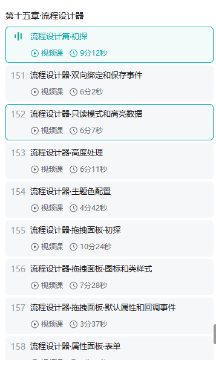

# mldong-flow-designer-plus
本项目包含了作者为B站课堂视频[《工作流设计器开发最佳实践》](https://www.bilibili.com/cheese/play/ss24484)的过程源码。教程中开发的组件也可用于实际生产环境中。以下是和使用文档和课程章节说明。
## 演示地址
本工程提供两个演示站，分别覆盖库本身和真实业务集成两种形态：

### 流程设计器演示站
[flow-designer.mldong.com](https://flow-designer.mldong.com/)

库本身的演示，包含请假 / 报销 / 会签 / 分支合并 / 自定义节点 5 个真业务场景（`?case=leave|expense|countersign|fork|custom|empty`）

### 业务系统集成演示
[flow-pro.mldong.com](https://flow-pro.mldong.com/)

把本流程设计器集成进真实业务系统后的形态，账号/密码：admin/123456

注：业务后端不开源
## npm 包
[mldong-flow-designer-plus](https://www.npmjs.com/package/mldong-flow-designer-plus)（双模式包：canvas 拖拽画布 + 钉钉风格树形设计器，mode prop 切换）

[mldong-flow-designer-dingtalk](https://www.npmjs.com/package/mldong-flow-designer-dingtalk)（钉钉精简包：仅钉钉风格设计器，零 LogicFlow 依赖，3.1.0 起与双模式包同版本联动发布）

国内用户可走 [淘宝镜像](https://registry.npmmirror.com/mldong-flow-designer-plus) 加速安装。

## 使用教程
[Vben5快速入门·AntdDesign版](https://www.bilibili.com/cheese/play/ep1382075)

[源码地址](https://gitee.com/course666/vue-vben-admin-v2/tree/v5/)


## 使用文档
### 兼容性注意
* 因Vite 需要 Node.js 版本 18+ 或 20+。当你的包管理器发出警告时，请注意升级你的 Node 版本。
* 本项目是在 Node.js 版本 16+的环境下测试通过。
### 下载
```shell
git clone https://gitee.com/mldong/flow-designer.git
```
### 安装
```shell
yarn add mldong-flow-designer-plus --registry=https://registry.npmmirror.com
# 或者
npm install mldong-flow-designer-plus --registry=https://registry.npmmirror.com 
```
### 全局注册
```javascript
import { createApp } from 'vue'
import FlowDesigner from 'mldong-flow-designer-plus'
import 'mldong-flow-designer-plus/lib/style.css'
const app = createApp(App)
app.use(FlowDesigner)
```
> 3.1.0 起内置 UI（抽屉/弹窗/表单/下拉/提示/JSON 查看器）全部自研（FD 组件族），
> **不再依赖 ant-design-vue / element-plus / vue-json-pretty**，
> 旧版 `uiLibrary` 安装参数已废弃（传入不报错、不生效）。
> 集成方宿主项目自身的 UI 库不受影响。
>
> 3.1.0 三件大事：
> 1. **砍掉第三方 UI 框架**：内置 UI 全部自研 FD 组件族，dependencies 仅 `@logicflow/*` + `vue`；
> 2. **补全内置工作流属性**：流程级 +8（字段权限/关联业务表/持久化模式/发起时选人/选人接口/抄送人/申请理由/附件）、任务级 +6（候选用户/候选用户组/候选用户处理类/会签类型/会签完成条件/操作按钮），对齐 vben5-wf 二开版，双模式内置表单均可配置；
> 3. **钉钉设计器视觉优化**：节点卡片紧凑化、层次强化、分支标题间距优化。
### 使用样例
#### 编辑模式
```html
<template>
  <MldongFlowDesignerPlus v-model:value="graphData" />
</template>
<script setup lang="ts">
import { ref } from 'vue';
const graphData = ref({
    name: 'leave1',
    displayName: '请假流程',
    postInterceptors: "leave_postInterceptors",
    nodes: [
      {
        id: "1",
        type: "snaker:start",
        x: 100,
        y: 100,
        properties: {
          // state: 'history'
          postInterceptors: "start_postInterceptors"
        }
      },
      {
        id: "2",
        type: "snaker:task",
        x: 300,
        y: 200,
        text: "节点2",
        properties: {
          // state: 'active'
          form: 'leaveForm',
          postInterceptors: "task_postInterceptors"
        }
      },
      {
        id: "3",
        type: "snaker:end",
        x: 500,
        y: 600,
        text: "结束",
        properties: {
          postInterceptors: "end_postInterceptors"
        }
      },
    ],
    edges: [
      {
        id: "1-2",
        sourceNodeId: "1",
        targetNodeId: "2",
        type: "snaker:transition",
        text: "连线",
        properties: {
          // state: 'history'
          expr: "${a} == 1"
        }
      },
      {
        id: "2-3",
        sourceNodeId: "2",
        targetNodeId: "3",
        type: "snaker:transition",
        text: "连线2",
        properties: {
          // state: 'history'
          expr: "${a} == 2"
        }
      },
    ],
  })
</script>
```
#### 只读模式
```html
<template>
  <MldongFlowDesignerPlus :viewer="true" v-model:value="graphData" />
</template>
<script setup lang="ts">
import { ref } from 'vue';
const graphData = ref({
    name: 'leave1',
    displayName: '请假流程',
    postInterceptors: "leave_postInterceptors",
    nodes: [
      {
        id: "1",
        type: "snaker:start",
        x: 100,
        y: 100,
        properties: {
          // state: 'history'
          postInterceptors: "start_postInterceptors"
        }
      },
      {
        id: "2",
        type: "snaker:task",
        x: 300,
        y: 200,
        text: "节点2",
        properties: {
          // state: 'active'
          form: 'leaveForm',
          postInterceptors: "task_postInterceptors"
        }
      },
      {
        id: "3",
        type: "snaker:end",
        x: 500,
        y: 600,
        text: "结束",
        properties: {
          postInterceptors: "end_postInterceptors"
        }
      },
    ],
    edges: [
      {
        id: "1-2",
        sourceNodeId: "1",
        targetNodeId: "2",
        type: "snaker:transition",
        text: "连线",
        properties: {
          // state: 'history'
          expr: "${a} == 1"
        }
      },
      {
        id: "2-3",
        sourceNodeId: "2",
        targetNodeId: "3",
        type: "snaker:transition",
        text: "连线2",
        properties: {
          // state: 'history'
          expr: "${a} == 2"
        }
      },
    ],
  })
</script>
```
### 属性说明
| 属性名 | 类型 | 默认值 | 说明 | 版本 |
| --- | --- | --- | --- | --- |
| v-model:value | object | - | 流程图数据 | - |
| theme | FDThemeConfig | - | 主题配置 |  - |
| highLight | FDHighLightType | 高亮配置 | - |
| initDndPanel | boolean | true | 是否初始化拖拽面板 |  - |
| dndPanel | FDPatternItem | - | 拖拽面板配置 | - |
| initControl | boolean | true | 是否初始化控制面板 |  - |
| control | FDControlItem | - | 控制面板配置 | - |
| blankContextmenu | Function | - | 画布右键事件 | 1.0.16+ |
| nodeClick | Function | - | 节点点击事件 | - |
| edgeClick | Function | - | 边点击事件 | - |
| drawerWidth | String | Number | 600px | 抽屉宽度 | - |
| modalWidth | String | Number | 60% | 弹窗宽度 | - |
| processForm | FDFormType | - | 流程表单配置 | - |
| edgeForm | FDFormType | - | 边表单配置 | - |
| defaultEdgeType | string | snaker:transition | 默认边 | - |
| typePrefix | string | snaker: | 自定义节点/边类型前缀 | - |
| viewer | boolean | false | 是否查看模式 | - |
| dagreOptions | Object | - | [自动布局配置](https://site.logic-flow.cn/tutorial/extension/layout#%E5%B8%83%E5%B1%80%E9%85%8D%E7%BD%AE%E9%80%89%E9%A1%B9) | 2.0.8+ |
| mode | `'canvas'` \| `'dingtalk'` | `'canvas'` | 渲染模式：canvas 为拖拽画布，dingtalk 为钉钉风格树形设计器 | 3.0.0+ |
#### FDThemeConfig
```typescript
export declare type FDThemeConfig = {
  primaryColor?: string; // 主题色
  edgePrimaryColor?: string; // 边主题色
  activeColor?: string; // 进行时节点颜色
  historyColor?: string; // 历史节点/边颜色
  backgroundColor ?: string;// 画布背景颜色
}
```
#### FDHighLightType
```typescript
export declare type FDHighLightType = {
  historyNodeNames?: Array<string>; // 历史节点名称
  historyEdgeNames?: Array<string>; // 历史边名称
  activeNodeNames?: Array<string>; // 活跃节点名称
  /**
   * 节点成员进度（可选，3.0.3+）：key=节点 id，value=该节点办理人列表及完成状态
   * 任意节点可带（历史节点 done、进行中节点 active）；会签节点额外带 type 区分并行/顺序
   * 钉钉模式 NodeCard 存在时渲染成员列表回显（✓已完成 / ▶当前轮到 / ·未处理）
   */
  nodeProgress?: {
    [nodeId: string]: {
      type?: 'PARALLEL' | 'SEQUENTIAL'; // 会签类型（仅会签节点）
      members: Array<FDNodeProgressMember>;
    }
  }
}
// 节点成员进度列表项
export declare type FDNodeProgressMember = {
  id: string; // 用户ID
  name: string; // 用户姓名（后端组装）
  done?: boolean; // 是否已完成（历史任务办理人）
  active?: boolean; // 当前轮到的办理人（进行中任务 / 顺序会签）
}
```
#### FDPatternItem
```typescript
export declare type FDPatternItem = {
  type?: string;
  text?: string;
  label?: string;
  icon?: string;
  className?: string;
  properties?: object;
  callback?: () => void;
  hide?: boolean; // 是否隐藏
  sort?: number; // 排序字段
  drawerTitle?: string;// 抽屉标题
  nodeClick?: (e: any) => void;
  form?: FDFormType; // 表单配置
};
```
#### FDControlItem
```typescript
export declare type FDControlItem = {
  key?: string; // 唯一编码
  iconClass?: string; // 图标类
  title?: string; // 标题
  text?: string; // 文本
  onClick?: Function // 事件函数
  hide?: boolean; // 是否隐藏
  sort?: number; // 排序字段
}
```
#### FDFormType和FDFormItemType
```typescript
/**
 * 表单数据类型
 */
export declare type FDFormType = {
  labelWidth?: string;
  formItems: Array<FDFormItemType>;
} 
/**
 * 表单项数据类型
 */
export declare type FDFormItemType = {
  name: string; // 表单项名称
  label?: string; // 表单项标签
  component?: 'Input' | 'Select'; // 表单组件
  render?: (args: any) => VNode;
  componentProps?: any; // 表单组件属性
} 
```
### 事件
| 事件名 | 说明 | 回调参数 | 版本 |
| --- | --- | --- | --- |
| on-init | 初始化事件 | (lf: any) => void | - |
| on-render | 渲染事件 | (lf: any) => void | - |
| on-save | 控制面板保存事件 | (graphData: any) => void | - |
| node-click | 节点点击事件（两种模式统一暴露，与 nodeClick prop 回调并存） | ({ data, patternItem, lf }) => void | 3.0.0+ |
| edge-click | 边点击事件（两种模式统一暴露，与 edgeClick prop 回调并存） | ({ data, patternItem, lf }) => void | 3.0.0+ |

## 钉钉模式（v3.0.0+）

通过 `mode="dingtalk"` 启用钉钉风格树形设计器，替代拖拽画布。适合审批流等线性流程场景。

### 启用方式

```html
<MldongFlowDesignerPlus v-model:value="graphData" mode="dingtalk" />
```

也可以通过流程定义数据中的 `mode` 字段自动识别：

```json
{ "mode": "dingtalk", "nodes": [...], "edges": [...] }
```

优先级：`prop > 数据字段 > 默认 'canvas'`

### API 兼容

钉钉模式暴露 `FDDesignerAPI`（`@on-init` / `@on-render` 回调参数），API 命名与 LogicFlow 实例一致：

| 方法 | 说明 |
|------|------|
| `updateText(id, text)` | 更新节点显示文本 |
| `setProperties(id, props)` | 设置节点属性（合并） |
| `getProperties(id)` | 读取节点属性 |
| `deleteProperty(id, key)` | 删除节点属性 |
| `changeNodeId(oldId, newId)` | 修改节点 ID |
| `getNodeDataById(id)` | 按 ID 查节点数据 |
| `setProcessProperty(key, value)` | 设置流程属性 |
| `getGraphData()` | 导出图数据 |
| `render(data)` | 重新渲染 |
| `graphModel` | Proxy，兼容 `lf.graphModel[key] = value` 写法 |
| `eventCenter` | 事件总线 |

业务方原有 vben5 的 `task-drawer` / `process-drawer` 等二次开发代码可在两种模式下复用。

### 自研组件

钉钉模式内置以下 UI 组件，零外部依赖：

- **DingDrawer**：右侧滑出抽屉，class 驱动 slide 动画
- **DingModal**：居中弹窗，zoom + fade 动画
- **DingTooltip**：hover 提示，替代原生 title

### dndPanel 合并策略

业务方自定义的 `dndPanel`（含 `nodeClick` 等配置）会与钉钉模式默认项（审批节点 / 自定义节点 / 子流程）合并，业务方同名 type 优先。

### 会签角标与成员进度回显（v3.0.3+）

- **会签角标**：会签节点（fork/join 或带 countersign 属性）在 NodeCard 右上角渲染角标，区分并行/顺序会签
- **成员进度回显**：`highLight.nodeProgress` 按节点 id 传入办理人列表，NodeCard 渲染成员列表（✓已完成 / ▶当前轮到 / ·未处理），适用于 viewer 只读模式展示审批进度

### 空流程默认初始化（v3.0.3+）

编辑模式下传入空的流程数据（无 nodes）时，自动初始化默认三节点（开始 → 审批人 → 结束），对齐 jeeflow-spec 发起申请约定；仅首次初始化，不会覆盖已有数据。

## 钉钉精简包（v3.1.0+）

包名 `mldong-flow-designer-dingtalk`，与双模式包**同一源码、同一版本号联动发布**，仅含钉钉风格树形设计器，**不含 LogicFlow 画布**，零 `@logicflow/*` 依赖，适合纯审批流场景极简引入。

```shell
npm install mldong-flow-designer-dingtalk --registry=https://registry.npmmirror.com
```

```html
<template>
  <MldongFlowDesignerPlus v-model:value="graphData" @on-save="handleSave" />
</template>
```

- 组件注册名、props/events 契约与双模式包的钉钉模式完全一致，两包可无缝切换
- `@on-init` / `@on-render` 回调参数为 `FDDesignerAPI`（命名与 LogicFlow 实例对齐）
- 需要 canvas 画布、存量画布流程兼容或双模式切换时，请使用双模式包 `mldong-flow-designer-plus`
- 本地构建精简产物：`npm run build:lib:lite`（输出 `lib-lite/`）

## 课程章节
* 第一章·基础篇
   - 搭建Vue3脚手架工程
   - 改造成Vue3组件库目录结构
   - 集成LogicFlow
   - 自定义节点初探
   - 自定义svg节点
   - 自定义html节点
   - 自定义vue节点
   - 自定义vue节点优化
   - 自定义边
   - 主题配置
   - 拖拽面板
   - 控制面板
* 第二章·进阶篇
   - 事件监听
   - 自定义事件
   - 数据转换 Adapter
   - 自定义插件初探
   - 自定义插件属性配置
   - svg图标处理(一)
   - svg图标处理(二)
* 第三章·实现篇·组件初探
   - 流程设计器组件初步设计
   - 流程设计器数据双向绑定实现
   - 流程设计器配置数据类型定义
   - 流程设计器节点高亮实现
   - 流程设计器边高亮实现
   - 流程设计器高亮主题配置
   - 流程设计器设置高亮属性
   - 流程设计器高亮属性配置实现
* 第四章·实现篇·拖拽面板
   - 拖拽元素·开始节点
   - 拖拽元素·结束节点
   - 开始节点和结束节点边连接规则
   - 拖拽元素·自定义任务节点
   - 拖拽元素·条件判断节点
   - 拖拽元素·分支与合并节点
   - 拖拽元素·子流程节点
   - 拖拽面板组件配置项·初探
   - 拖拽面板组件配置项·属性覆盖及隐藏控制
   - 拖拽面板组件配置项·节点事件
   - 拖拽面板组件配置项·边事件
   - 初始化事件注册自定义节点
   - 拖拽元素排序
* 第五章·实现篇·UI适配
   - UI适配·初探
   - UI适配·Button组件(一)
   - UI适配·Button组件(二)
   - 增加UI适配器类
   - UI适配器优化
   - UI适配注意事项
   - UI适配·抽屉组件初探
   - UI适配·抽屉组件和节点边事件处理
   - UI适配·抽屉组件动态标题
   - UI适配·抽屉组件动态标题优化
   - UI适配·抽屉组件宽度配置
   - UI适配·antd表单
   - UI适配·element-plus表单
* 第六章·实现篇·元数据表单
   - 元数据表单·简单数据结构
   - 元数据表单·开始节点和结束节点
   - 元数据表单·用户任务节点(一)
   - 元数据表单·用户任务节点(二)
   - 元数据表单·labelWidth属性处理
   - 元数据表单·其它拖拽节点
   - 元数据表单·流程表单和自定义配置
   - 元数据表单·自定义渲染函数
   - 元数据表单·自定义函数之v-model
   - 元数据表单·自定义组件实现v-model
   - 元数据表单·边表单和自定义配置
* 第七章·实现篇·流程图数据
   - 流程图数据·节点和边表单赋值
   - 流程图数据·流程表单赋值
   - 流程图数据·表单数据变化监听处理初探
   - 流程图数据·表单数据变化监听处理优化
   - 流程图数据·流程表单数据变化监听处理
   - 流程图数据·修复上一步下一步bug
* 第八章·实现篇·控制面板
   - 控制面板·配置化初探
   - 控制面板·配置化实现
   - 控制面板·自定义图标
   - 控制面板·查看流程数据弹窗适配
   - 控制面板·查看流程数据
   - 控制面板·查看流程数据复制
   - 控制面板·导入流程数据弹窗
   - 控制面板·导入流程数据逻辑处理
   - 控制面板·设置高亮数据
   - 控制面板·导入和高亮UI适配
   - 控制面板·保存按钮逻辑处理
   - 控制面板·清空逻辑处理
* 第九章·打包部署篇
   - 打包发布篇·初探
   - 打包发布篇·云效流水线(一)
   - 打包发布篇·云效流水线(三)
   - 打包发布篇·依赖包安装测试
   - 打包发布篇·svg转base64处理
   - 打包发布篇·本地包调试
   - 打包发布篇·本地包调试错误修复
   - 打包发布篇·组件类型推导配置
   - 打包发布篇·组件类型推导之代码提示
   - 打包发布篇·组件定义类型导出
   - 打包发布篇·修复1.0.4版编译失败bug
